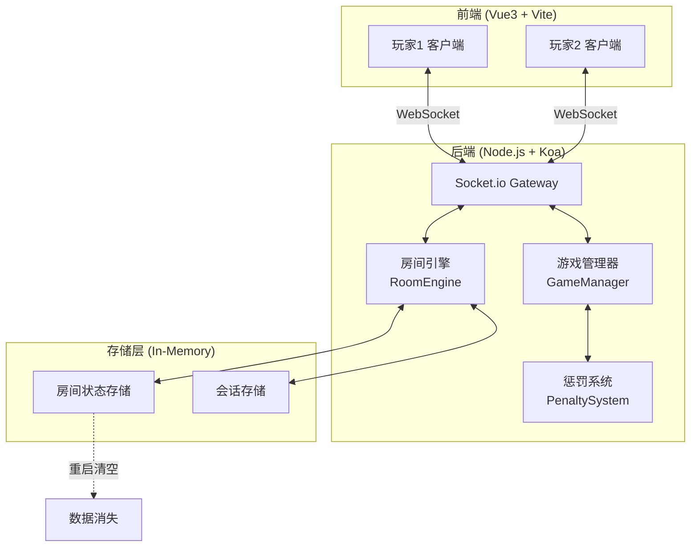
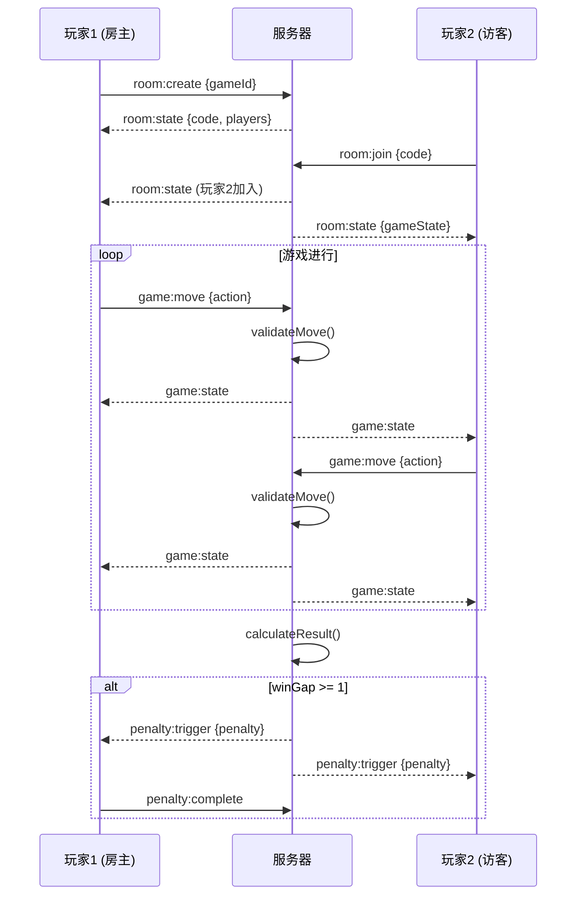
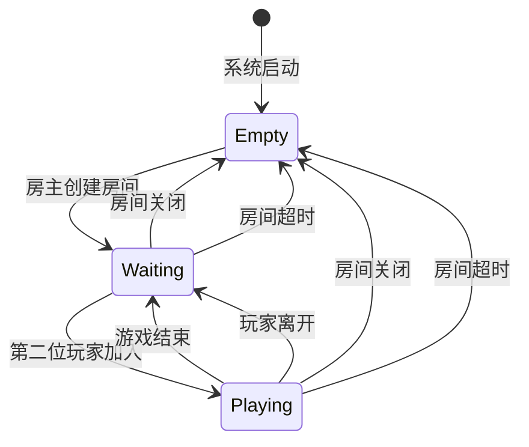

# 双人对战系统技术设计方案

需求名称：duel-battle-system
更新日期：2026-04-03

## 1. 概述

### 1.1 项目简介

Project Heartbeat 是一个基于 Docker 部署的轻量化双人实时竞技平台。其核心特点是去中心化（无登录）、即时性（开房即玩）以及深度集成的惩罚反馈机制，旨在为亲密关系或熟人社交提供极具氛围感的互动体验。

### 1.2 设计目标

- **即时接入**: 访问即分配临时 Session ID，无需注册登录
- **房间对战**: 6 位房间码 + URL 直连两种加入方式
- **插件化架构**: 统一游戏接口，支持扩展如五子棋、飞行棋、扑克等
- **惩罚驱动**: 阶梯式惩罚系统，根据胜负差值自动触发
- **隐私保障**: 内存存储，容器重启后数据物理抹除

## 2. 技术架构

### 2.1 技术栈

| 层级 | 技术选型 | 说明 |
|------|----------|------|
| 前端框架 | Vue 3 + Vite | 组合式 API (Composition API) |
| UI 样式 | Tailwind CSS | 原子化 CSS 方案 |
| 图标库 | Lucide Icons | 轻量级 SVG 图标 |
| 后端框架 | Node.js + Koa | 轻量级 Web 框架 |
| 实时通讯 | Socket.io | WebSocket 封装 |
| 容器化 | Docker + Alpine Linux | 极致瘦身镜像 |
| 数据存储 | In-Memory | 无持久化，保证隐私 |

### 2.2 系统架构图



### 2.3 前后端交互流程



## 3. 核心模块设计

### 3.1 房间管理系统 (Room Engine)

#### 3.1.1 功能接口

```typescript
// 房间引擎核心接口
interface RoomEngine {
  createRoom(hostId: string, gameId: string): RoomState;
  joinRoom(code: string, playerId: string): RoomState | Error;
  leaveRoom(code: string, playerId: string): void;
  closeRoom(code: string): void;
  getRoom(code: string): RoomState | null;
}
```

#### 3.1.2 房间状态机



#### 3.1.3 房间码生成规则

- 格式: 6 位大写字母数字混合 (A-Z, 0-9，排除易混淆字符 0/O, 1/I/L)
- 长度: 2,176,782,720 种组合
- 生成方式: 密码学安全的随机数生成器

### 3.2 游戏插件系统 (Game Plugin System)

#### 3.2.1 插件接口定义

```typescript
interface GamePlugin {
  // 游戏唯一标识 (kebab-case)
  id: string;
  
  // 游戏显示名称
  name: string;
  
  // 所需玩家数量
  getRequiredPlayers(): number;
  
  // 初始化游戏状态
  initBoard(): GameState;
  
  // 校验玩家操作是否合法
  validateMove(move: GameMove, state: GameState): boolean;
  
  // 根据当前状态判断游戏结果
  calculateResult(state: GameState): GameResult;
  
  // 获取当前可执行的操作列表
  getValidMoves(state: GameState, playerId: string): GameMove[];
}
```

#### 3.2.2 内置游戏示例: 石头剪刀布

```typescript
const RockPaperScissors: GamePlugin = {
  id: 'rock-paper-scissors',
  name: '石头剪刀布',
  
  getRequiredPlayers: () => 2,
  
  initBoard: () => ({
    board: null,  // 无需棋盘
    moves: {},    // 记录双方出拳
    phase: 'waiting'  // waiting | resolved
  }),
  
  validateMove: (move, state) => {
    return ['rock', 'paper', 'scissors'].includes(move.choice);
  },
  
  calculateResult: (state) => {
    const { moves } = state;
    const playerIds = Object.keys(moves);
    if (playerIds.length < 2) return { winner: null, isDraw: false };
    
    const choices = playerIds.map(id => moves[id]);
    if (choices[0] === choices[1]) {
      return { winner: null, isDraw: true };
    }
    
    const winMap = { rock: 'scissors', paper: 'rock', scissors: 'paper' };
    const winner = winMap[choices[0]] === choices[1] ? playerIds[0] : playerIds[1];
    return { winner, isDraw: false };
  },
  
  getValidMoves: () => ['rock', 'paper', 'scissors']
};
```

#### 3.2.3 插件注册机制

```typescript
// 游戏插件注册表
const gameRegistry = new Map<string, GamePlugin>();

function registerGame(plugin: GamePlugin): void {
  if (gameRegistry.has(plugin.id)) {
    throw new Error(`Game ${plugin.id} already registered`);
  }
  gameRegistry.set(plugin.id, plugin);
}

function getGame(id: string): GamePlugin | undefined {
  return gameRegistry.get(id);
}

function listGames(): GamePlugin[] {
  return Array.from(gameRegistry.values());
}
```

### 3.3 惩罚系统 (Penalty System)

#### 3.3.1 阶梯式惩罚等级

| 等级 | 触发条件 (胜负差值) | 惩罚类型 | 示例内容 |
|------|-------------------|----------|----------|
| Level 1 | Gap 1-2 | 轻微肢体触碰与言语暧昧 | 耳间呢喃、指尖火种 |
| Level 2 | Gap 3-4 | 羞耻感增强与服从性互动 | 身份契约、命令服从 |
| Level 3 | Gap 5-6 | 敏感部位接触与视觉冲击 | 湿润路径、视觉引导 |
| Level 4 | Gap 7+ | 绝对控制与感官剥夺 | 神谕时间、感官控制 |

#### 3.3.2 惩罚数据模型

```typescript
interface Penalty {
  id: string;
  level: 1 | 2 | 3 | 4;
  name: string;           // 惩罚名称
  description: string;    // 惩罚描述
  duration: number;        // 持续时间(秒)，0 表示手动结束
  type: 'action' | 'verbal' | 'visual' | 'physical';
}

interface PenaltyLevel {
  level: 1 | 2 | 3 | 4;
  minGap: number;
  maxGap: number;
  items: Penalty[];
}
```

#### 3.3.3 惩罚选择算法

```typescript
// backend/src/penalty/selector.ts

interface PenaltySelector {
  selectPenalty(winDiff: number, history: Penalty[]): Penalty;
}

class RandomPenaltySelector implements PenaltySelector {
  private levels: PenaltyLevel[];
  
  constructor(levels: PenaltyLevel[]) {
    this.levels = levels.sort((a, b) => a.level - b.level);
  }
  
  selectPenalty(winDiff: number, history: Penalty[]): Penalty {
    const level = this.determineLevel(winDiff);
    const eligible = level.items.filter(
      p => !this.wasRecentlyUsed(p, history)
    );
    
    if (eligible.length === 0) {
      return this.randomPick(level.items);
    }
    
    return this.randomPick(eligible);
  }
  
  private determineLevel(winDiff: number): PenaltyLevel {
    for (const lvl of this.levels) {
      if (winDiff < lvl.maxGap) {
        return lvl;
      }
    }
    return this.levels[this.levels.length - 1];
  }
  
  private wasRecentlyUsed(penalty: Penalty, history: Penalty[]): boolean {
    const recentWindow = 5;
    return history.slice(-recentWindow).some(p => p.id === penalty.id);
  }
  
  private randomPick<T>(arr: T[]): T {
    return arr[Math.floor(crypto.randomUUID() * arr.length)];
  }
}
```

#### 3.3.4 惩罚配置数据

```typescript
// backend/src/penalty/data.ts

export const PENALTY_DATA: PenaltyLevel[] = [
  {
    level: 1,
    minGap: 1,
    maxGap: 2,
    items: [
      { id: 'L1-1', level: 1, name: '耳间呢喃', description: '获胜者在对方耳边说出一句甜言蜜语', duration: 10, type: 'verbal' },
      { id: 'L1-2', level: 1, name: '指尖火种', description: '用指尖轻轻划过对方手背', duration: 5, type: 'action' },
      { id: 'L1-3', level: 1, name: '眼神放电', description: '对视 10 秒，期间不许眨眼', duration: 10, type: 'visual' },
    ]
  },
  {
    level: 2,
    minGap: 3,
    maxGap: 4,
    items: [
      { id: 'L2-1', level: 2, name: '身份契约', description: '输家必须称呼赢家为"主人"持续三局', duration: 180, type: 'verbal' },
      { id: 'L2-2', level: 2, name: '命令服从', description: '赢家可以命令输家做一个简单动作', duration: 30, type: 'action' },
    ]
  },
  {
    level: 3,
    minGap: 5,
    maxGap: 6,
    items: [
      { id: 'L3-1', level: 3, name: '湿润路径', description: '用冰块沿脊柱缓缓滑下', duration: 20, type: 'physical' },
      { id: 'L3-2', level: 3, name: '视觉引导', description: '蒙眼，由对方引导完成指定任务', duration: 60, type: 'visual' },
    ]
  },
  {
    level: 4,
    minGap: 7,
    maxGap: Infinity,
    items: [
      { id: 'L4-1', level: 4, name: '神谕时间', description: '闭眼沉默 2 分钟，完全服从对方指令', duration: 120, type: 'physical' },
      { id: 'L4-2', level: 4, name: '感官剥夺', description: '佩戴耳塞和眼罩，由对方控制感知', duration: 180, type: 'physical' },
    ]
  }
];
```

## 4. 组件与接口

### 4.1 项目目录结构

```
project-heartbeat/
├── frontend/                      # Vue3 前端项目
│   ├── src/
│   │   ├── assets/               # 静态资源
│   │   ├── components/           # 通用组件
│   │   │   ├── common/           # 通用 UI 组件
│   │   │   │   ├── GlassCard.vue    # 毛玻璃卡片
│   │   │   │   ├── NeonButton.vue   # 霓虹按钮
│   │   │   │   └── PenaltyPopup.vue # 惩罚弹窗
│   │   │   └── game/             # 游戏通用组件
│   │   │       ├── GameBoard.vue    # 游戏棋盘
│   │   │       └── PlayerInfo.vue    # 玩家信息
│   │   ├── views/                # 页面视图
│   │   │   ├── HomeView.vue         # 首页/创建房间
│   │   │   ├── RoomView.vue         # 房间视图
│   │   │   └── GameView.vue         # 游戏视图
│   │   ├── stores/               # Pinia 状态管理
│   │   │   ├── room.ts              # 房间状态
│   │   │   ├── game.ts              # 游戏状态
│   │   │   └── socket.ts            # Socket 连接
│   │   ├── games/                 # 游戏前端实现
│   │   │   └── rock-paper-scissors/
│   │   │       ├── components/       # 游戏专属组件
│   │   │       └── composables/      # 游戏逻辑
│   │   ├── composables/          # 组合式函数
│   │   │   ├── useSocket.ts         # Socket 连接
│   │   │   └── usePenalty.ts        # 惩罚逻辑
│   │   ├── styles/
│   │   │   └── main.css           # 全局样式
│   │   ├── App.vue
│   │   └── main.ts
│   ├── index.html
│   ├── vite.config.ts
│   ├── tailwind.config.js
│   └── package.json
├── backend/                       # Node.js 后端项目
│   ├── src/
│   │   ├── server.ts              # Koa 主入口
│   │   ├── socket/
│   │   │   ├── index.ts           # Socket.io 初始化
│   │   │   ├── room.handler.ts    # 房间事件处理
│   │   │   └── game.handler.ts     # 游戏事件处理
│   │   ├── rooms/
│   │   │   ├── RoomEngine.ts      # 房间引擎
│   │   │   ├── RoomState.ts       # 房间状态模型
│   │   │   └── inMemoryStore.ts   # 内存存储
│   │   ├── games/
│   │   │   ├── GamePlugin.ts      # 插件接口
│   │   │   ├── GameManager.ts     # 游戏管理器
│   │   │   ├── RockPaperScissors.ts  # 石头剪刀布
│   │   │   └── registry.ts        # 插件注册表
│   │   ├── penalty/
│   │   │   ├── PenaltySystem.ts   # 惩罚系统
│   │   │   ├── selector.ts        # 选择算法
│   │   │   └── data.ts            # 惩罚数据
│   │   ├── utils/
│   │   │   └── roomCode.ts        # 房间码生成
│   │   └── types/
│   │       └── index.ts           # 类型定义
│   ├── package.json
│   └── tsconfig.json
├── docker/
│   └── Dockerfile
├── docker-compose.yml
└── package.json                   # 根目录 workspace 配置
```

### 4.2 Socket.io 事件接口

#### 4.2.1 客户端 → 服务端 (Client to Server)

| 事件名 |  payload | 描述 |
|--------|----------|------|
| `room:create` | `{ gameId: string }` | 创建房间 |
| `room:join` | `{ code: string }` | 加入房间 |
| `room:leave` | `{}` | 离开房间 |
| `game:move` | `{ move: GameMove }` | 发送游戏操作 |
| `penalty:complete` | `{}` | 惩罚执行完成确认 |

#### 4.2.2 服务端 → 客户端 (Server to Client)

| 事件名 | payload | 描述 |
|--------|---------|------|
| `room:created` | `{ code: string }` | 房间创建成功 |
| `room:joined` | `{ room: RoomState }` | 加入房间成功 |
| `room:state` | `{ room: RoomState }` | 房间状态更新 |
| `room:error` | `{ code: string, message: string }` | 房间错误 |
| `game:state` | `{ state: GameState }` | 游戏状态更新 |
| `game:result` | `{ result: GameResult }` | 游戏结果 |
| `penalty:trigger` | `{ penalty: Penalty }` | 触发惩罚 |
| `penalty:timeout` | `{}` | 惩罚超时 |

### 4.3 REST API 接口 (HTTP)

| 方法 | 路径 | 描述 |
|------|------|------|
| GET | `/api/games` | 获取可用游戏列表 |
| GET | `/api/health` | 健康检查 |

### 4.4 前端组件设计

#### 4.4.1 核心组件

| 组件 | 路径 | 说明 |
|------|------|------|
| `GlassCard` | `components/common/GlassCard.vue` | 毛玻璃效果卡片容器 |
| `NeonButton` | `components/common/NeonButton.vue` | 带霓虹呼吸灯效果的按钮 |
| `PenaltyPopup` | `components/common/PenaltyPopup.vue` | 惩罚触发弹窗 (金色边框) |
| `GameBoard` | `components/game/GameBoard.vue` | 游戏棋盘通用容器 |
| `PlayerInfo` | `components/game/PlayerInfo.vue` | 玩家信息展示 (头像、分数、状态) |

#### 4.4.2 视图组件

| 视图 | 路由 | 说明 |
|------|------|------|
| `HomeView` | `/` | 首页：创建房间、选择游戏 |
| `RoomView` | `/room/:code` | 房间等待界面 |
| `GameView` | `/game/:code` | 游戏进行界面 |

### 4.5 后端服务设计

#### 4.5.1 Koa 服务器配置

```typescript
// backend/src/server.ts
import Koa from 'koa';
import { createServer } from 'http';
import { Server } from 'socket.io';
import { roomHandler } from './socket/room.handler';
import { gameHandler } from './socket/game.handler';

const app = new Koa();
const httpServer = createServer(app);

const io = new Server(httpServer, {
  cors: {
    origin: '*',
    methods: ['GET', 'POST']
  }
});

// Socket.io 事件绑定
io.on('connection', (socket) => {
  roomHandler(socket, io);
  gameHandler(socket, io);
});

const PORT = process.env.PORT || 8080;
httpServer.listen(PORT, () => {
  console.log(`Server running on port ${PORT}`);
});
```

#### 4.5.2 房间引擎核心实现

```typescript
// backend/src/rooms/RoomEngine.ts
import { RoomState, Player } from '../types';
import { generateRoomCode } from '../utils/roomCode';
import { InMemoryStore } from './inMemoryStore';

export class RoomEngine {
  private store: InMemoryStore;
  
  constructor() {
    this.store = new InMemoryStore();
  }
  
  createRoom(hostId: string, gameId: string): RoomState {
    const code = generateRoomCode();
    const room: RoomState = {
      code,
      gameId,
      hostId,
      players: [{ id: hostId, isReady: true }],
      status: 'waiting',
      createdAt: Date.now()
    };
    
    this.store.setRoom(code, room);
    return room;
  }
  
  joinRoom(code: string, playerId: string): RoomState | Error {
    const room = this.store.getRoom(code);
    if (!room) {
      return new Error('Room not found');
    }
    if (room.players.length >= 2) {
      return new Error('Room is full');
    }
    if (room.players.some(p => p.id === playerId)) {
      return new Error('Player already in room');
    }
    
    room.players.push({ id: playerId, isReady: false });
    if (room.players.length === 2) {
      room.status = 'playing';
    }
    
    this.store.setRoom(code, room);
    return room;
  }
  
  leaveRoom(code: string, playerId: string): void {
    const room = this.store.getRoom(code);
    if (!room) return;
    
    room.players = room.players.filter(p => p.id !== playerId);
    
    if (room.players.length === 0) {
      this.store.deleteRoom(code);
    } else if (room.hostId === playerId) {
      room.hostId = room.players[0].id;
      room.status = 'waiting';
    }
  }
  
  getRoom(code: string): RoomState | null {
    return this.store.getRoom(code);
  }
  
  closeRoom(code: string): void {
    this.store.deleteRoom(code);
  }
}
```

## 5. 数据模型

### 5.1 类型定义

```typescript
// backend/src/types/index.ts

// 玩家
interface Player {
  id: string;
  isReady: boolean;
  score?: number;
}

// 房间状态
interface RoomState {
  code: string;
  gameId: string;
  hostId: string;
  players: Player[];
  status: 'waiting' | 'playing' | 'closed';
  createdAt: number;
}

// 游戏动作
interface GameMove {
  playerId: string;
  action: string;  // 游戏特定的操作
  timestamp: number;
}

// 游戏状态
interface GameState {
  board: any;
  currentPlayer: string | null;
  players: string[];
  moves: GameMove[];
  phase: 'waiting' | 'playing' | 'finished';
  winner: string | null;
  isDraw: boolean;
}

// 游戏结果
interface GameResult {
  winner: string | null;
  isDraw: boolean;
  scores: Record<string, number>;
  winGap: number;
}

// 惩罚
interface Penalty {
  id: string;
  level: 1 | 2 | 3 | 4;
  name: string;
  description: string;
  duration: number;
  type: 'action' | 'verbal' | 'visual' | 'physical';
}
```

### 5.2 内存存储结构

```typescript
// backend/src/rooms/inMemoryStore.ts
import { RoomState } from '../types';

export class InMemoryStore {
  private rooms: Map<string, RoomState> = new Map();
  private sessions: Map<string, { roomCode: string; playerId: string }> = new Map();
  
  setRoom(code: string, room: RoomState): void {
    this.rooms.set(code, room);
  }
  
  getRoom(code: string): RoomState | undefined {
    return this.rooms.get(code);
  }
  
  deleteRoom(code: string): void {
    this.rooms.delete(code);
  }
  
  setSession(playerId: string, roomCode: string): void {
    this.sessions.set(playerId, { roomCode, playerId });
  }
  
  getSession(playerId: string): { roomCode: string; playerId: string } | undefined {
    return this.sessions.get(playerId);
  }
  
  clearRoom(code: string): void {
    for (const [playerId, session] of this.sessions) {
      if (session.roomCode === code) {
        this.sessions.delete(playerId);
      }
    }
    this.rooms.delete(code);
  }
}
```

## 6. 正确性属性

### 6.1 状态一致性

- **服务器权威模型**: 所有游戏逻辑在服务端执行和校验，客户端仅负责展示
- **乐观更新限制**: 客户端不允许直接修改游戏状态，所有变更需经服务端确认
- **操作序列化**: 服务端按接收顺序处理玩家操作，保证一致性

### 6.2 房间隔离性

- **状态隔离**: 每个房间维护独立的状态副本
- **事件隔离**: Socket.io room 机制确保事件仅发送到房间内玩家
- **超时隔离**: 各房间独立计时，不相互影响

### 6.3 数据隐私性

- **内存存储**: 所有数据存储在内存中，容器重启后自动清空
- **无持久化**: 不存在任何磁盘写入操作
- **会话管理**: 玩家断开连接后会话数据自动清理

### 6.4 并发安全性

- **房间码唯一性**: 使用密码学安全随机数生成器，避免碰撞
- **状态修改原子性**: 房间状态更新使用原子操作
- **连接限制**: 每房间最多 2 名玩家，防止资源耗尽

## 7. 错误处理

### 7.1 错误类型定义

```typescript
enum RoomError {
  ROOM_NOT_FOUND = 'ROOM_NOT_FOUND',
  ROOM_FULL = 'ROOM_FULL',
  PLAYER_ALREADY_IN_ROOM = 'PLAYER_ALREADY_IN_ROOM',
  NOT_ROOM_HOST = 'NOT_ROOM_HOST',
  GAME_NOT_STARTED = 'GAME_NOT_STARTED',
  INVALID_MOVE = 'INVALID_MOVE',
  ALREADY_IN_GAME = 'ALREADY_IN_GAME'
}

enum GameError {
  INVALID_MOVE = 'INVALID_MOVE',
  NOT_YOUR_TURN = 'NOT_YOUR_TURN',
  GAME_NOT_IN_PROGRESS = 'GAME_NOT_IN_PROGRESS'
}
```

### 7.2 错误处理策略

| 错误场景 | 处理方式 | 用户可见性 |
|----------|----------|------------|
| 房间码无效 | 返回 `ROOM_NOT_FOUND` 错误 | 显示"房间不存在" |
| 房间已满 | 返回 `ROOM_FULL` 错误 | 显示"房间已满" |
| 非法游戏操作 | 返回 `INVALID_MOVE` 错误 | 不显示，忽略操作 |
| 非本人回合 | 返回 `NOT_YOUR_TURN` 错误 | 不显示，忽略操作 |
| 连接中断 | 保留房间 5 分钟 | 显示"等待重连" |
| 惩罚超时 | 自动进入下一局 | 显示"惩罚超时" |

### 7.3 断线重连处理

```typescript
// backend/src/socket/room.handler.ts

socket.on('disconnect', () => {
  const session = store.getSession(socket.id);
  if (session) {
    const room = store.getRoom(session.roomCode);
    if (room) {
      // 标记玩家断线
      const player = room.players.find(p => p.id === session.playerId);
      if (player) {
        player.isConnected = false;
      }
      
      // 通知另一名玩家
      socket.to(session.roomCode).emit('player:disconnected', {
        playerId: session.playerId
      });
      
      // 启动 5 分钟超时计时器
      setTimeout(() => {
        const currentRoom = store.getRoom(session.roomCode);
        if (currentRoom?.players.some(p => p.id === session.playerId && !p.isConnected)) {
          roomEngine.leaveRoom(session.roomCode, session.playerId);
          io.to(session.roomCode).emit('room:closed', { reason: 'player_timeout' });
        }
      }, 5 * 60 * 1000);
    }
  }
});
```

## 8. 测试策略

### 8.1 测试框架选型

| 层级 | 框架 | 说明 |
|------|------|------|
| 单元测试 | Vitest | 快速、轻量，与 Vite 集成良好 |
| 集成测试 | Supertest | HTTP API 测试 |
| E2E 测试 | Playwright | 端到端浏览器测试 |

### 8.2 测试用例示例

#### 8.2.1 房间引擎测试

```typescript
// backend/src/rooms/__tests__/RoomEngine.test.ts
import { describe, it, expect } from 'vitest';
import { RoomEngine } from '../RoomEngine';

describe('RoomEngine', () => {
  const engine = new RoomEngine();
  
  describe('createRoom', () => {
    it('should create a room with 6-digit code', () => {
      const room = engine.createRoom('player1', 'rock-paper-scissors');
      expect(room.code).toMatch(/^[A-HJ-NP-Z2-9]{6}$/);
      expect(room.players).toHaveLength(1);
      expect(room.status).toBe('waiting');
    });
  });
  
  describe('joinRoom', () => {
    it('should allow second player to join', () => {
      const room = engine.createRoom('player1', 'rock-paper-scissors');
      const joined = engine.joinRoom(room.code, 'player2');
      expect(joined.players).toHaveLength(2);
      expect(joined.status).toBe('playing');
    });
    
    it('should reject third player', () => {
      const room = engine.createRoom('player1', 'rock-paper-scissors');
      engine.joinRoom(room.code, 'player2');
      const result = engine.joinRoom(room.code, 'player3');
      expect(result).toBeInstanceOf(Error);
      expect((result as Error).message).toBe('Room is full');
    });
  });
});
```

#### 8.2.2 游戏插件测试

```typescript
// backend/src/games/__tests__/RockPaperScissors.test.ts
import { describe, it, expect } from 'vitest';
import { RockPaperScissors } from '../RockPaperScissors';

describe('RockPaperScissors', () => {
  const game = RockPaperScissors;
  
  describe('validateMove', () => {
    it('should accept valid moves', () => {
      const state = game.initBoard();
      expect(game.validateMove({ choice: 'rock' }, state)).toBe(true);
      expect(game.validateMove({ choice: 'paper' }, state)).toBe(true);
      expect(game.validateMove({ choice: 'scissors' }, state)).toBe(true);
    });
    
    it('should reject invalid moves', () => {
      const state = game.initBoard();
      expect(game.validateMove({ choice: 'invalid' }, state)).toBe(false);
    });
  });
  
  describe('calculateResult', () => {
    it('should detect draw', () => {
      const state = game.initBoard();
      state.moves = { p1: 'rock', p2: 'rock' };
      const result = game.calculateResult(state);
      expect(result.isDraw).toBe(true);
    });
    
    it('should determine winner correctly', () => {
      const state = game.initBoard();
      state.moves = { p1: 'rock', p2: 'scissors' };
      const result = game.calculateResult(state);
      expect(result.winner).toBe('p1');
    });
  });
});
```

#### 8.2.3 惩罚系统测试

```typescript
// backend/src/penalty/__tests__/selector.test.ts
import { describe, it, expect } from 'vitest';
import { RandomPenaltySelector } from '../selector';
import { PENALTY_DATA } from '../data';

describe('RandomPenaltySelector', () => {
  const selector = new RandomPenaltySelector(PENALTY_DATA);
  
  it('should select Level 1 for gap 1-2', () => {
    for (let gap = 1; gap <= 2; gap++) {
      const penalty = selector.selectPenalty(gap, []);
      expect(penalty.level).toBe(1);
    }
  });
  
  it('should select Level 2 for gap 3-4', () => {
    for (let gap = 3; gap <= 4; gap++) {
      const penalty = selector.selectPenalty(gap, []);
      expect(penalty.level).toBe(2);
    }
  });
  
  it('should select Level 4 for gap >= 7', () => {
    const penalty = selector.selectPenalty(10, []);
    expect(penalty.level).toBe(4);
  });
  
  it('should avoid recently used penalties', () => {
    const history = [{ id: 'L1-1', level: 1, name: 'test' } as any];
    const penalty = selector.selectPenalty(1, history);
    expect(penalty.id).not.toBe('L1-1');
  });
});
```

## 9. Docker 部署

### 9.1 Dockerfile

```dockerfile
# backend/Dockerfile
FROM node:18-alpine AS base

WORKDIR /app

# 安装依赖
COPY package*.json ./
RUN npm ci --only=production

# 复制源码
COPY . .

# 暴露端口
EXPOSE 8080

# 启动命令
CMD ["node", "src/server.js"]
```

### 9.2 Docker Compose 配置

```yaml
# docker-compose.yml
version: '3.8'

services:
  heartbeat:
    build:
      context: .
      dockerfile: docker/Dockerfile
    ports:
      - "8080:8080"
    environment:
      - NODE_ENV=production
      - PORT=8080
    restart: unless-stopped
    healthcheck:
      test: ["CMD", "wget", "-qO-", "http://localhost:8080/api/health"]
      interval: 30s
      timeout: 10s
      retries: 3
```

### 9.3 部署命令

```bash
# 构建并运行
docker-compose up -d --build

# 查看日志
docker-compose logs -f

# 停止服务
docker-compose down
```

## 10. 安全与隐私

### 10.1 数据安全

- **无持久化存储**: 所有数据仅存在于内存中
- **容器重启即抹除**: 任何数据不会写入磁盘
- **会话隔离**: 不同房间数据完全隔离

### 10.2 通讯安全

- **SSL 终止**: 建议在 Nginx 层配置 HTTPS
- **CORS 控制**: 仅允许配置的域名访问
- **输入校验**: 所有 Socket 事件参数严格校验

### 10.3 部署安全

- **非 root 用户运行**: Docker 容器使用 node 用户
- **最小权限**: 仅开放必要端口
- **内网部署**: 支持完全内网运行，无需互联网连接

## 11. 参考链接

[^1]: [Vue 3 官方文档](https://vuejs.org/)
[^2]: [Koa 官方文档](https://koajs.com/)
[^3]: [Socket.io 官方文档](https://socket.io/)
[^4]: [Tailwind CSS 官方文档](https://tailwindcss.com/)
[^5]: [Docker 官方文档](https://docs.docker.com/)
